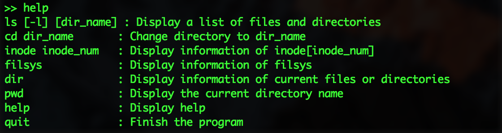

# v6sh実装

## 環境
- MacBook
    - macOS Sierra version 10.12.5
- Python 3.6.0
    - おそらくPython3なら動く

## コンパイル方法
- pythonなので必要なし

## 実行方法
```
./v6sh
```
- `v6sh`は`python v6sh.py`を実行しているだけ

## 実行のスクリーンショット
- `ls`


- `cd usr` & `ls`


- `ls -l`


- `help`



## 苦労(工夫)した点
- 一応helpとか作ってそれらしくした
- pythonの`array[i : j]`の意味を間違えていたせいで上手くいかなかった
    - `array[i : j]` はarrayのi番目からj番目の前まで(i番目からj番目だと思って上手くいかなかった．原因追及に時間がかかった)
- numpy使えばもう少し高速になると思う
    - ダウンロードする必要があるため，今回は使わなかった
    - 多分Python3なら実行できるはず
- クラスの変数でソートができるのは初めて知った
```
# 名前順にソート
sorted(dir_list, key=lambda dir_c: dir_c.name)
```
- `cd /usr/bin`とかできるようにしたい
